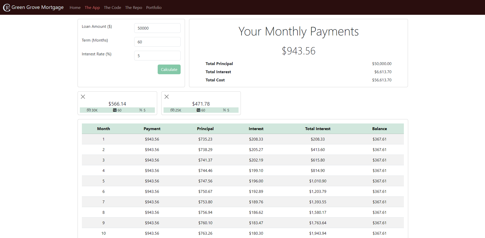
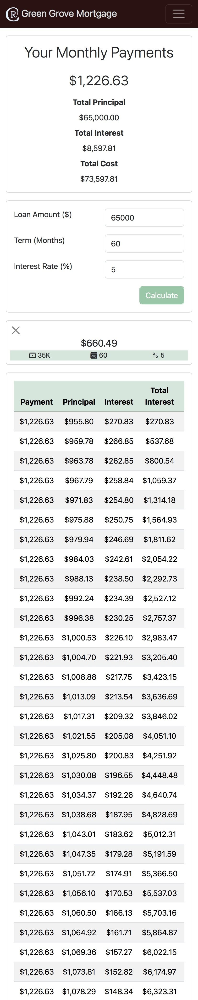

# Green Grove Mortgage - A Coding Challenge

A mortgage calculator

## Table of contents

- [Overview](#overview)
  - [Screenshot](#screenshot)
  - [Links](#links)
- [My process](#my-process)
  - [Built with](#built-with)
  - [What I learned](#what-i-learned)
  - [Possible Improvements](#possible-improvements)
  - [Useful resources](#useful-resources)
- [Author](#author)

## Overview

### Screenshot

Desktop Web App Screenshot:

Mobile Web App Screenshot:
 

### Links

- Live Site URL: [Netlify](https://glittering-queijadas-fe3bfc.netlify.app/)
- Repo URL: [Github Repo](https://github.com/rebcop/GreenGroveMortgage)

## My process

### Built with

- CSS and Bootstrap Layout
- JavaScript Fundamentals
- JavaScript Loops
- JavaScript DOM Manipulation
- Async JavaScript Functions
- JavaScript Fetch & API Usage
- TECH STACK: JavaScript, HTML, CSS, Bootstrap

### What I learned

1. Use Object.fromEntries to easily grab values from a form as an object
2. Use localStorage.clear to clear the local storage or just assign the variables saved to empty values

### Possible Improvements
1. When user clicks on history card, it populates the page fields based on the values from that card
2. Button to see all past history cards
3. Labeling so user knows what the icons are
   
### Useful resources

- [Bootstrap Docs](https://getbootstrap.com/docs/5.3/getting-started/introduction/)
- [W3 Schools](https://www.w3schools.com/js/)
- [MDN Web Docs](https://developer.mozilla.org/en-US/docs/Web/JavaScript)

## Author

- Check out my portfolio - [Rebecca Copeland](https://rebcop.dev/)
- Message Me - [LinkedIn](https://www.linkedin.com/in/rebcop/)
